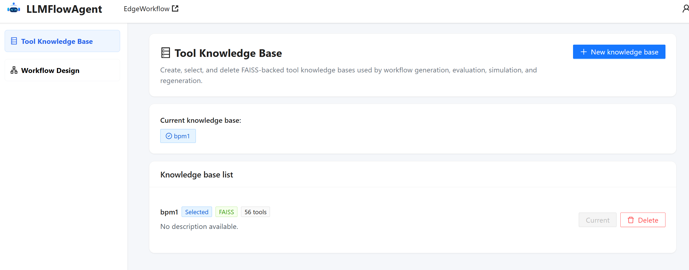
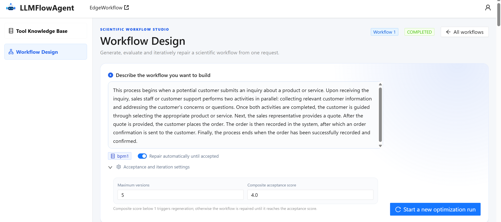
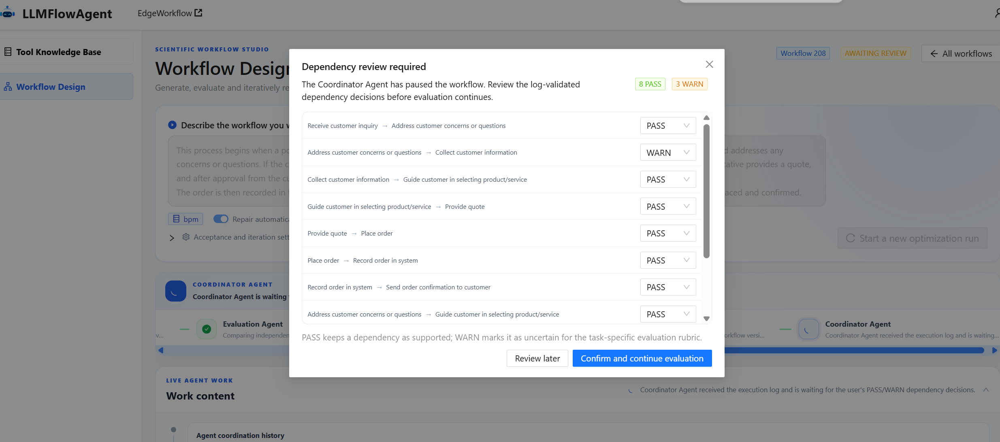
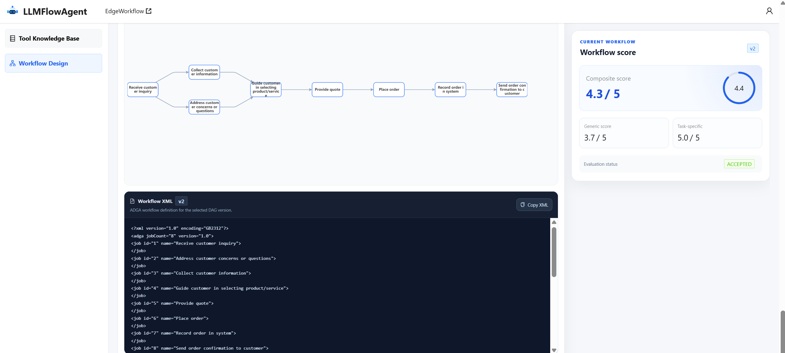

# LLMFlowAgent: An LLM-Based Multi-Agent Collaborative Framework for Workflow Modeling

LLMFlowAgent employs four specialized agents to emulate the iterative modeling process of human experts, enabling workflow model generation and refinement from users' natural-language descriptions.

## 🎥 Demonstration

For more details, you can watch the [demo video]().

## ✍️ How to Use

LLMFlowAgent is publicly accessible through our [online system](http://1.13.189.179).

### 1. Prepare a tool knowledge base

Open **Tool Knowledge Base** to select an existing knowledge base or create one by uploading a tool-description file. A knowledge base defines the tools or APIs that the system can use when constructing a workflow model.


### 2. Describe the workflow

Open **Workflow Design** and enter a natural-language description of the workflow you want to build. You can also configure the acceptance threshold, maximum number of evaluation rounds, and automatic-repair option.


### 3. Start the modeling process

Click **Start a new optimization run**. The Coordinator Agent invokes the specialized agents to generate an initial workflow model, evaluate its quality, and regenerate or repair it according to the evaluation result.

### 4. Review agent activity and provide confirmation

Follow the live activity records of the four agents. If the system identifies uncertain dependencies or asks you to choose a workflow version, respond through the confirmation dialog displayed on the page.


### 5. Inspect the result

Inspect the generated workflow DAG, evaluation scores, evaluation report, repair history, and workflow versions. The accepted or highest-scoring version is returned as the final workflow model.


## 👮‍♂️ Evaluation

We evaluate LLMFlowAgent on TaskBench and study whether its complete multi-agent loop is more effective than direct generation or partially ablated variants. The reported experiments address two questions:

- **RQ1:** How accurately does LLMFlowAgent generate workflow models compared with representative baselines?
- **RQ2:** How much does each agent and the Coordinator's adaptive routing contribute to the complete framework?

### Dataset and Evaluation Evidence

We use 300 normalized workflow modeling tasks from **TaskBench** [1], a public multimedia tool-orchestration benchmark. The tasks cover image processing, audio and video conversion, and text editing. Each sample contains a natural-language requirement and a reference API workflow represented as a directed acyclic graph (DAG), where nodes denote APIs and edges denote their invocation dependencies.

The selected workflows contain an average of 3.71 nodes and 2.72 dependency edges, while the largest contains 8 nodes and 7 edges. These statistics make TaskBench suitable for evaluating both API selection and dependency construction under controlled workflow structures.

To provide consistent execution evidence, every ground-truth workflow is converted into an executable Petri net. PM4Py [2] then simulates execution traces and exports them as XES event logs. Consequently, each evaluation sample contains a natural-language description, a reference DAG, and a controlled ground-truth-derived event log.

### Metrics

We evaluate workflow generation quality at different levels of structural granularity. Let $N$ denote the number of workflow modeling tasks. For each task, let $G_{\mathrm{gt}}=(V_{\mathrm{gt}},E_{\mathrm{gt}})$ and $G_{\mathrm{pred}}=(V_{\mathrm{pred}},E_{\mathrm{pred}})$ denote the ground-truth and generated workflow models, respectively.

#### Perfect Match Rate

Perfect Match Rate (PMR) evaluates the correctness of the complete workflow structure:

$$
\operatorname{PMR}=\frac{1}{N}\sum_{i=1}^{N}\mathbb{I}\left(G_{\mathrm{pred},i}=G_{\mathrm{gt},i}\right).
$$

The indicator function returns one only when both $V_{\mathrm{pred},i}=V_{\mathrm{gt},i}$ and $E_{\mathrm{pred},i}=E_{\mathrm{gt},i}$; otherwise, it returns zero.

#### Node and Dependency Matching

We use set-based Precision, Recall, and F1 to evaluate the accuracy of workflow node selection and dependency construction. For $X\in\{V,E\}$:

$$
\operatorname{Precision}(X)=\frac{|X_{\mathrm{pred}}\cap X_{\mathrm{gt}}|}{|X_{\mathrm{pred}}|}, \qquad
\operatorname{Recall}(X)=\frac{|X_{\mathrm{pred}}\cap X_{\mathrm{gt}}|}{|X_{\mathrm{gt}}|},
$$

$$
\operatorname{F1}(X)=\frac{2\,\operatorname{Precision}(X)\operatorname{Recall}(X)}{\operatorname{Precision}(X)+\operatorname{Recall}(X)}.
$$

When $X=V$, the resulting Node F1 measures agreement between the generated and ground-truth workflow nodes. When $X=E$, Edge F1 measures the correctness of the generated dependency relationships. Dataset-level results are obtained by averaging the corresponding F1 scores across all workflow modeling tasks.

#### Simplified Graph Edit Distance

We use a set-based simplified Graph Edit Distance (sGED) to quantify the overall structural difference between a generated workflow and its ground truth:

$$
\operatorname{sGED}(G_{\mathrm{pred}},G_{\mathrm{gt}})=
|V_{\mathrm{gt}}\setminus V_{\mathrm{pred}}|+
|V_{\mathrm{pred}}\setminus V_{\mathrm{gt}}|+
|E_{\mathrm{gt}}\setminus E_{\mathrm{pred}}|+
|E_{\mathrm{pred}}\setminus E_{\mathrm{gt}}|.
$$

sGED counts missing and redundant nodes and dependency edges. A lower value indicates that the generated workflow is structurally closer to the ground-truth model. Dataset-level sGED is obtained by averaging the scores across all workflow modeling tasks.

### Baselines

To validate its effectiveness, we compare LLMFlowAgent with five representative methods covering prompting-based, retrieval-augmented, and workflow-specific generation paradigms.

#### Few-shot [3]

Under the few-shot setting, the LLM receives the workflow requirement, the complete API list, several workflow generation examples, and a predefined JSON output schema. It then directly generates the workflow DAG.

#### Chain-of-Thought (CoT) [4]

The CoT baseline provides the LLM with the workflow requirement and complete API list and prompts it to reason step by step about the required APIs and their dependencies before generating the workflow DAG.

#### RAG+CoT [4,5]

RAG+CoT first retrieves the top-$k$ candidate APIs from the API knowledge base according to the workflow requirement. CoT prompting is subsequently applied to select the required APIs and construct their dependency relationships.

#### ProMoAI [6]

ProMoAI employs LLMs and prompt engineering to transform natural-language process descriptions into process models. It incorporates error handling and code generation and supports interactive model refinement through user feedback.

#### LLM4Workflow [7]

LLM4Workflow retrieves relevant API knowledge according to a natural-language workflow description and employs an LLM to generate an executable workflow model.

### Implementation Details

LLMFlowAgent and all baselines use GPT-4o as their primary generation model. For multi-model dependency analysis, LLMFlowAgent uses GPT-4o together with `deepseek-chat`, `gemini-3-flash-preview`, and `qwen-plus`. The maximum number of evaluation rounds is five. On the five-point evaluation scale, workflows scoring 1 or below are regenerated, workflows scoring above 1 but below 4 are repaired, and workflows scoring 4 or above are accepted; if no version reaches the acceptance threshold, the highest-scoring version is returned.

We construct a fixed API knowledge base from the tool summaries provided by TaskBench. Reference edges and workflow topology are excluded. Entries are encoded with `text-embedding-v2`, stored in a vector index, and reranked with `qwen3-rerank`. All methods use the same underlying tool inventory, and retrieval-based methods use the same fixed index.

### Overall Workflow Modeling Results (RQ1)

| Method | PMR (%) ↑ | Node F1 (%) ↑ | Edge F1 (%) ↑ | sGED ↓ |
|:--|--:|--:|--:|--:|
| Few-shot | 25.00 | 85.27 | 56.64 | 4.26 |
| CoT | 33.33 | 88.17 | 60.53 | 3.58 |
| RAG+CoT | 30.00 | 89.46 | 60.40 | 3.55 |
| ProMoAI | 26.67 | 87.57 | 59.49 | 4.35 |
| LLM4Workflow | 54.33 | 92.09 | 79.32 | 1.80 |
| **LLMFlowAgent** | **63.67** | **96.24** | **81.45** | **1.45** |

LLMFlowAgent achieves the best result across all four metrics. LLM4Workflow is the strongest baseline on TaskBench; compared with it, LLMFlowAgent improves PMR, Node F1, and Edge F1 by 9.34, 4.15, and 2.13 percentage points, respectively, while reducing sGED from 1.80 to 1.45, a relative reduction of 19.44%.

The improvement in Node F1 is consistent with the use of task decomposition, query rewriting, and knowledge-grounded API retrieval, which help the Generation Agent identify APIs that better match the workflow requirement. More importantly, the larger improvement in PMR indicates that the subsequent evaluation and repair process corrects critical dependency errors that prevent otherwise nearly correct DAGs from exactly matching the reference models. Overall, the results show that LLMFlowAgent improves both individual node and dependency decisions and the correctness of the complete workflow structure.

**Answer to RQ1:** LLMFlowAgent consistently outperforms all baseline methods on TaskBench. Its improvements in Edge F1, PMR, and sGED demonstrate a stronger ability to construct complete and accurate dependency structures for workflow modeling tasks.

### Ablation Study (RQ2)

The TaskBench ablation study keeps the model and retrieval configuration of every remaining component unchanged:

- **w/o Coordinator:** replaces quality-aware routing with a fixed Generation–Evaluation–Repair sequence.
- **w/o Evaluation & Repair:** returns the Generation Agent's initial DAG without evaluation or refinement.
- **w/o Evaluation:** asks the Repair Agent to revise the requirement and current DAG without an evaluator-generated repair plan.
- **w/o Repair:** sends the Evaluation Agent's repair plan to the Generation Agent for complete DAG regeneration instead of targeted modification.

| Setting | PMR (%) ↑ | Node F1 (%) ↑ | Edge F1 (%) ↑ | sGED ↓ |
|:--|--:|--:|--:|--:|
| w/o Coordinator | 62.00 | 94.51 | 80.24 | 1.57 |
| w/o Evaluation & Repair | 54.33 | 90.19 | 76.38 | 1.96 |
| w/o Evaluation | 55.67 | 90.67 | 77.57 | 1.90 |
| w/o Repair | 62.33 | 95.46 | 80.39 | 1.58 |
| **LLMFlowAgent** | **63.67** | **96.24** | **81.45** | **1.45** |

Removing any component degrades workflow generation performance, while the complete framework achieves the best result across all four metrics.

**1) Role of the Coordinator Agent.** Removing the Coordinator Agent decreases Node F1, Edge F1, and PMR by 1.73, 1.21, and 1.67 percentage points, respectively, while increasing sGED by 0.12. The fixed-sequence variant invokes Generation, Evaluation, and Repair regardless of the current workflow quality. By contrast, the Coordinator Agent routes low-quality workflows to regeneration and locally correctable workflows to targeted repair, enabling quality-aware refinement.

**2) Effect of removing Evaluation and Repair.** This variant exhibits the largest overall degradation. Node F1, Edge F1, and PMR decrease by 6.05, 5.07, and 9.34 percentage points, respectively, while sGED increases by 0.51. Without evaluation and repair, missing or redundant nodes and incorrect dependencies in the initial DAG remain undetected and uncorrected. The particularly large PMR decrease shows that the evaluation–repair loop is important for complete-structure correctness.

**3) Role of the Evaluation Agent.** Removing the Evaluation Agent decreases Node F1, Edge F1, and PMR by 5.57, 3.88, and 8.00 percentage points, respectively, while increasing sGED by 0.45. The Evaluation Agent provides more than an overall score: it uses fine-grained rubrics to localize modeling errors and translate them into concrete repair instructions. Without this guidance, the Repair Agent cannot reliably determine how the initial DAG should be modified.

**4) Role of the Repair Agent.** The w/o Repair variant obtains the best ablated Node F1, Edge F1, and PMR because the Generation Agent can partially regenerate the workflow from evaluation feedback. Nevertheless, its Node F1, Edge F1, and PMR remain 0.78, 1.06, and 1.34 percentage points below the complete framework, respectively, and its sGED is 0.13 higher. This result shows that repair-plan-guided local modifications preserve valid workflow structures more effectively than regenerating the complete DAG.

**5) Synergistic gains of the complete framework.** The Generation Agent constructs the initial workflow, the Evaluation Agent identifies fine-grained errors and formulates repair guidance, and the Repair Agent performs targeted modifications. The Coordinator Agent orchestrates their interactions and selects the next action from the evaluation result. Their complementary operation enables iterative improvement that cannot be achieved by any individual component alone.

**Answer to RQ2:** The ablation results confirm the contribution of each agent and show that their integration under the Coordinator Agent enables LLMFlowAgent to achieve the best overall workflow modeling performance.

## 🛠️ Getting Started

Follow the steps below to run LLMFlowAgent on your local machine.

### Prerequisites

- Git
- Python 3.11
- Node.js 20 and npm
- PostgreSQL 16
- API keys for the LLM providers selected in `backend/config/llm_providers.yaml`

### 1. Clone the Repository

```bash
git clone git@github.com:ISEC-AHU/LLMFlowAgent.git
cd LLMFlowAgent
```

### 2. Prepare PostgreSQL

Start PostgreSQL and create an empty database for LLMFlowAgent:

```bash
psql -U postgres
```

Then run the following SQL command:

```sql
CREATE DATABASE llmflowagent;
```

The required tables are created automatically when the backend starts for the first time.

### 3. Configure and Start the Backend

Create and activate a Python virtual environment:

```bash
cd backend
python -m venv .venv
```

On Windows PowerShell:

```powershell
.\.venv\Scripts\Activate.ps1
Copy-Item .env.example .env
```

On Linux or macOS:

```bash
source .venv/bin/activate
cp .env.example .env
```

Edit `backend/.env` and set the local PostgreSQL credentials and the API keys required by the selected LLM providers:

```dotenv
DB_NAME=llmflowagent
DB_USER=postgres
DB_PASSWORD=your-postgresql-password
DB_HOST=localhost
DB_PORT=5432

OPENAI_API_KEY=your-openai-key
GEMINI_API_KEY=your-gemini-key
QWEN_API_KEY=your-qwen-key
DEEPSEEK_API_KEY=your-deepseek-key
```

Provider endpoints, models, and agent-role mappings are configured in `backend/config/llm_providers.yaml`. Keep all credentials in `backend/.env` and do not commit this file.

Install the dependencies and start the backend:

```bash
python -m pip install -r requirements.txt
python -m uvicorn server:app --host 127.0.0.1 --port 8000 --reload
```

The backend API documentation is available at <http://localhost:8000/docs>.

### 4. Start the Frontend

Open another terminal and run:

```bash
cd frontend
npm install
npm run dev
```

Open <http://localhost:5173> to use LLMFlowAgent. The frontend connects to the local backend at <http://localhost:8000> by default.

## 📚 References

1. Y. Shen, K. Song, X. Tan, W. Zhang, K. Ren, S. Yuan, *et al.*, [“TaskBench: Benchmarking Large Language Models for Task Automation,”](https://proceedings.neurips.cc/paper_files/paper/2024/file/085185ea97db31ae6dcac7497616fd3e-Paper-Datasets_and_Benchmarks_Track.pdf) in *Advances in Neural Information Processing Systems*, vol. 37, pp. 4540–4574, 2024.
2. A. Berti, S. van Zelst, and D. Schuster, [“PM4Py: A Process Mining Library for Python,”](https://doi.org/10.1016/j.simpa.2023.100556) *Software Impacts*, vol. 17, Art. no. 100556, 2023.
3. T. Brown, B. Mann, N. Ryder, M. Subbiah, J. D. Kaplan, P. Dhariwal, *et al.*, [“Language Models Are Few-Shot Learners,”](https://proceedings.neurips.cc/paper_files/paper/2020/hash/1457c0d6bfcb4967418bfb8ac142f64a-Abstract.html) in *Advances in Neural Information Processing Systems*, vol. 33, pp. 1877–1901, 2020.
4. J. Wei, X. Wang, D. Schuurmans, M. Bosma, B. Ichter, F. Xia, *et al.*, [“Chain-of-Thought Prompting Elicits Reasoning in Large Language Models,”](https://proceedings.neurips.cc/paper/2022/hash/9d5609613524ecf4f15af0f7b31abca4-Abstract.html) in *Advances in Neural Information Processing Systems*, vol. 35, pp. 24824–24837, 2022.
5. P. Lewis, E. Perez, A. Piktus, F. Petroni, V. Karpukhin, N. Goyal, *et al.*, [“Retrieval-Augmented Generation for Knowledge-Intensive NLP Tasks,”](https://proceedings.neurips.cc/paper/2020/hash/6b493230205f780e1bc26945df7481e5-Abstract.html) in *Advances in Neural Information Processing Systems*, vol. 33, pp. 9459–9474, 2020.
6. H. Kourani, A. Berti, D. Schuster, and W. M. P. van der Aalst, [“ProMoAI: Process Modeling with Generative AI,”](https://doi.org/10.24963/ijcai.2024/1014) in *Proceedings of the Thirty-Third International Joint Conference on Artificial Intelligence*, pp. 8708–8712, 2024.
7. J. Xu, W. Du, X. Liu, and X. Li, [“LLM4Workflow: An LLM-Based Automated Workflow Model Generation Tool,”](https://doi.org/10.1145/3691620.3695360) in *Proceedings of the 39th IEEE/ACM International Conference on Automated Software Engineering*, pp. 2394–2398, 2024.
